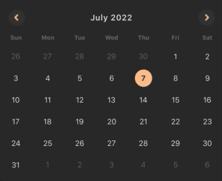

# React Native Easy Calendar



Customizable, easy-to-use, performant calendar components for React Native.

[React Native Easy Calendar](#react-native-easy-calendar)

- [Concept](#concept)
- [Roadmap](#roadmap)
- [Compatibility](#compatibility)
- [Installation](#installation)

[Usage](#usage)

- [Themes](#themes)
- [Locale](#locale)
- [Custom Components](#custom-components)

[Calendars](#calendars)

- [Date Selection Calendar](#date-selection-calendar)

[Contributing](#contributing)

- [License](#license)

## Concept

The community's been well-served by Wix's [react-native-calendars](https://github.com/wix/react-native-calendars) for years and this package aims to provide a leaner but equally capable alterative by:

- splitting up calendar functionalities into thin wrapper.components with leaner, more contextual APIs.
- supporting a granular, cleaner, shareable version of themes.
- supporting locales through [Dayjs](https://github.com/iamkun/dayjs), which offers 138 locales out of the box (at last count), but won't include any of them in your bundle unless you use it.
- making the calendars controlled components, which elimates the need for most _onEvent()_ callbacks.
- providing sane defaults and ONLY allowing component structure/behaviour to be altered by passing in custom components and NOT through behavior-altering props. This single-source-of-truth pattern leads to less confusion and cleans up the API.
- offering Typescript support out of the box.

## Roadmap

_[September 2020]:_ Currently, we support only a single-date selection calendar. In the next couple of releases:

- add multi-date selection support
- add period selection calendar
- add `makeNumberOfLinesConsistent` prop
- increased code coverage

## Compatibility

We're compatible with RN 0.59+.

## Installation

RN Easy Calendar has no dependencies and only one peer dependency. [Dayjs](https://github.com/iamkun/dayjs) has all the power of [Momentjs's](https://github.com/moment/moment/) API at only a tiny fraction of the size (2kb, compared to momentjs's 69.6kb).

```sh
$ yarn add react-native-easy-calendar dayjs
```

# Usage


Locale, themes, and custom components will be treated the same way in all the calendars. Each calendar might have slightly different props, however, in order to make then as contextual as possible.

## Themes

The `theme` prop is optional. If you don't pass the `theme` prop, the calendar will use the DefaultTheme. Both the [Theme](src/Entities/Theme.ts) entity and the [DefaultTheme](src/Themes/DefaultTheme.ts) object have been exported for your use.

```jsx
import { DateSelectionCalendar, DefaultTheme, Theme } from 'react-native-easy-calendar'

const ThemedCalendar = () => {
  const [selectedDate, setSelectedDate] = React.useState('2020-02-01');

  return (
    <DateSelectionCalendar
      theme={CustomTheme};
      onSelectDate={setSelectedDate}
      selectedDate={selectedDate}
    />
  );
};

const CustomTheme: Theme = {
  ...DefaultTheme,
  extraDayText: {
    color: 'orange'
  }
}

```

## Locale

The `locale` prop is optional. If you don't pass the `locale` prop, the calendar will use _en-US_ as the default. RN Easy Calendar supports locales through [Dayjs](https://github.com/iamkun/dayjs). All you have to do is [import the correct file](https://github.com/iamkun/dayjs/tree/dev/src/locale) and pass it to the component.

```jsx
import { DateSelectionCalendar } from 'react-native-easy-calendar'
import French from 'dayjs/locale/fr';

const LocaleExample = () => {
  const [selectedDate, setSelectedDate] = React.useState('2020-02-01');

  return (
    <DateSelectionCalendar
      locale={French};
      onSelectDate={setSelectedDate}
      selectedDate={selectedDate}
    />
  );
};
```

### Customizing Locales

What you import from Dayjs is just an object, which makes it very easy to customize. [Override any of the keys in the object](https://github.com/iamkun/dayjs/blob/dev/src/locale/en-gb.js) and pass the new, custom locale to the calendar.

```jsx
import { DateSelectionCalendar } from 'react-native-easy-calendar'
import PortuguesBrasileiro from 'dayjs/locale/pt-br';

const CustomLocaleExample = () => {
  const [selectedDate, setSelectedDate] = React.useState('2020-02-01');

  return (
    <DateSelectionCalendar
      locale={CustomLocale};
      onSelectDate={setSelectedDate}
      selectedDate={selectedDate}
    />
  );
};

const CustomLocale = {
  ...PortuguesBrasileiro,
  weekdaysMin: 'D_S_T_Q_Q_S_S'.split('_'),
}
```

# Custom Components

The calendar components' structure or behavior can only be customized by overriding them.

<details>
<summary>Arrow</summary>
Your custom arrows must have the following signature and will receive the following props.

```typescript
export type ArrowComponentType = (props: ArrowProps) => JSX.Element;

export interface ArrowProps {
  direction: 'left' | 'right';
  isDisabled: boolean;
  onPress: () => void;
}
```

By default, the arrows will be disabled when you've reached the limits imposed by the `minDate` and `maxDate` props.

**[IMPORTANT**]: Remember to call the `onPress` callback!

```jsx
import React from 'react';
import { Text, TouchableOpacity } from 'react-native';
import { DateSelectionCalendar } from 'react-native-easy-calendar';

const CustomArrow = ({ direction, isDisabled, onPress }) => (
  <TouchableOpacity onPress={onPress} disabled={isDisabled}>
    <Text>{`${direction === 'left' ? '<' : '>'}`}</Text>
  </TouchableOpacity>
);

const CustomComponents = () => {
  const [selectedDate, setSelectedDate] = React.useState('2020-07-05');

  return (
    <DateSelectionCalendar
      onSelectDate={setSelectedDate}
      selectedDate={selectedDate}
      ArrowComponent={CustomArrow}
    />
  );
};

export default CustomComponents;
```

</details>

<details>
<summary>Title</summary>
Your custom title must have the following signature and will receive the following props.

```typescript
export type TitleComponentType = (props: TitleProps) => JSX.Element;

export enum VIEW {
  YEAR,
  MONTH,
}

export interface TitleProps {
  date: Dayjs;
  onPress: () => void;
  isDisabled: boolean;
  activeView: VIEW;
}
```

By default, the title will be disabled only when you've passed `allowYearView={false}`. The `activeView` will equal either `VIEW.YEAR` or `VIEW.MONTH`. The `date` passed will represent what is currently visible. If you're in `VIEW.MONTH`, the date will be a start-of-month date (September 1st, 2020 for the month of September 2020, for example). If you're in `VIEW.YEAR`, the date will be a start-of-year date (January 1st, 2020 for the year of 2020, for example).

**[IMPORTANT]**: Remember to call the `onPress` callback!

```jsx
import React from 'react';
import { Text, TouchableOpacity } from 'react-native';
import { DateSelectionCalendar, VIEW } from 'react-native-easy-calendar';

const CustomTitle = ({ date, onPress, isDisabled, activeView }) => (
  <TouchableOpacity onPress={onPress} disabled={isDisabled}>
    <Text>
      {activeView === VIEW.MONTH ? `${date.format('MMMM YYYY')}` : `${date.format('YYYY')}`}
    </Text>
  </TouchableOpacity>
);

const CustomComponents = () => {
  const [selectedDate, setSelectedDate] = React.useState('2020-07-05');

  return (
    <DateSelectionCalendar
      onSelectDate={setSelectedDate}
      selectedDate={selectedDate}
      TitleComponent={CustomTitle}
    />
  );
};

export default CustomComponents;
```

</details>

<details>
<summary>Weekdays</summary>

Your custom weekdays must have the following signature and will receive the following props.

```typescript
export type WeekdaysComponentType = (props: WeekdaysProps) => JSX.Element;

export interface WeekdaysProps {
  days: string[];
}
```

The `days` prop is an array of strings resulting from a call to `locale.weekdaysShort()`.

```jsx
import React from 'react';
import { Text, View } from 'react-native';
import { DateSelectionCalendar, VIEW } from 'react-native-easy-calendar';

const CustomWeekdays = ({ days }) => (
  <View
    style={{
      flexDirection: 'row',
      justifyContent: 'space-between',
      paddingVertical: 15,
      borderColor: '#000',
      borderBottomWidth: 1,
      borderTopWidth: 1,
    }}>
    {days.map((day, index) => (
      <Text
        key={index}
        style={{
          width: width / 7,
          textAlign: 'center',
          fontSize: 10,
        }}>
        {day.toLocaleUpperCase()}
      </Text>
    ))}
  </View>
);

const CustomComponents = () => {
  const [selectedDate, setSelectedDate] = React.useState('2020-07-05');

  return (
    <DateSelectionCalendar
      onSelectDate={setSelectedDate}
      selectedDate={selectedDate}
      WeekdaysComponent={CustomWeekdays}
    />
  );
};

export default CustomComponents;
```

</details>

<details>
<summary>Month</summary>
The month component is the component that is rendered 12 times in `VIEW.YEAR`. Your custom months must have the following signature and will receive the following props.

```typescript
export type MonthComponentType = (props: MonthProps) => JSX.Element;

export interface MonthProps {
  date: Dayjs;
  onPress: () => void;
  isSelected: boolean;
  isDisabled: boolean;
}
```

By default, a month will be disabled when you've reached the limits imposed by the `minDate` and `maxDate` props. A month will be selected when the `selectedDate` prop belongs to that month. The `date` will be a start-of-month date (September 1st, 2020 for the month of September 2020, for example).

**[IMPORTANT]**: Remember to call the `onPress` callback!

```jsx
import React from 'react';
import { Text, TouchableOpacity } from 'react-native';
import { DateSelectionCalendar, VIEW } from 'react-native-easy-calendar';

const CustomMonth = ({ date, onPress, isSelected, isDisabled }) => (
  <TouchableOpacity
    style={{
      width: width * 0.32,
      height: 50,
      alignItems: 'center',
      justifyContent: 'center',
    }}
    onPress={onPress}
    disabled={isDisabled}>
    <Text style={{ color: isSelected ? 'green' : 'black' }}>{date.format('MMM')}</Text>
  </TouchableOpacity>
);

const CustomComponents = () => {
  const [selectedDate, setSelectedDate] = React.useState('2020-07-05');

  return (
    <DateSelectionCalendar
      onSelectDate={setSelectedDate}
      selectedDate={selectedDate}
      MonthComponent={CustomMonth}
    />
  );
};

export default CustomComponents;
```

</details>

<details>
<summary>Day</summary>

The day component is the component that is rendered 28 to 31 times in `VIEW.MONTH`. Your custom days must have the following signature and will receive the following props.

```typescript
export type DayComponentType = (props: DayProps) => JSX.Element;

// The day props are so extensive to make theming as granular as possible.
interface OtherProps {
  date: Dayjs | null;
  onPress: (date: string) => void;
  // Used in period selection calendar
  isPeriod?: boolean;
  isPeriodStart?: boolean;
  isPeriodEnd?: boolean;
  // Used in date selection calendar
  isSelected?: boolean;
  // Used in both calendars
  isDisabled?: boolean;
  isStartOfWeek?: boolean;
  isEndOfWeek?: boolean;
  isStartOfMonth?: boolean;
  isEndOfMonth?: boolean;
  isExtraDay?: boolean;
  showExtraDates?: boolean;
}
```

The `date` prop is `null` only when `isExtraDay === true && showExtraDates === false`. By default, the day is disabled when it is included in the `disabledDates` prop, when you've reached the limits imposed by the `maxDate` and `minDate` props, or when `isExtraDay == true`.

**[IMPORTANT]**: Remember to call the `onPress` callback!

```jsx
import React from 'react';
import { Text, TouchableOpacity } from 'react-native';
import { DateSelectionCalendar } from 'react-native-easy-calendar';

const CustomDay = ({ date, onPress, isDisabled, ...otherBooleanProps }) => (
  <TouchableOpacity
    onPress={onPress}
    disabled={isDisabled}
    style={{
      height: 32,
      width: width / 7,
      justifyContent: 'center',
      alignItems: 'center',
      marginVertical: 4,
    }}>
    <Text>{date?.date()}</Text>
  </TouchableOpacity>
);

const CustomComponents = () => {
  const [selectedDate, setSelectedDate] = React.useState('2020-07-05');

  return (
    <DateSelectionCalendar
      onSelectDate={setSelectedDate}
      selectedDate={selectedDate}
      DayComponent={CustomDay}
    />
  );
};

export default CustomComponents;
```

</details>
</p>

# Calendars

## Date Selection Calendar

For now, this calendar supports only the selection of a single date. Multi-date selection upcoming.

```jsx
import { DateSelectionCalendar, DefaultTheme } from 'react-native-easy-calendar'
import frenchLocale from 'dayjs/locale/fr';

const Example = () => {
  const [selectedDate, setSelectedDate] = React.useState('2020-02-01');

  return (
    <DateSelectionCalendar
      {/* The following props are optional */}
      disabledDates={['2020-01-01', '2020-03-04']}
      minDate={'2020-01-10'};
      maxDate={'2020-04-10'};
      allowYearView={false}; // default true
      showExtraDates={true}; // default false
      testID={'my-calendar-component'};
      locale={frenchLocale}; // default en-US
      theme={DefaultTheme};
      {/* The following props are required */}
      onSelectDate={setSelectedDate}
      selectedDate={selectedDate}
    />
  );
};
```

# Contributing

Contributors welcome! See the [contributing guide](CONTRIBUTING.md) to learn how to contribute to the repository and the development workflow.

## License

MIT
