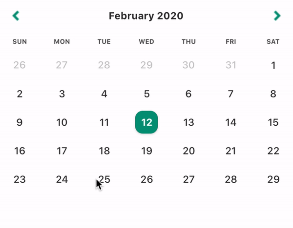
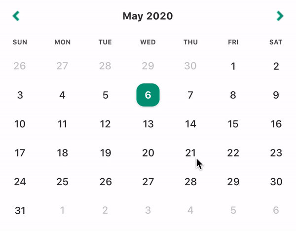

<div align="center">
  
</div>

<h3 align="center">
  Customizable, easy-to-use, performant calendar components for React Native. 🗓📆
</h3>

</br>
<div align="center">
  <a href="https://codecov.io/gh/aryella-lacerda/react-native-easy-calendar">
    
    
    
  </a>
</div>
</br>

<div align="center">
  <kbd>
    
  </kbd>
  <kbd>
    
  </kbd>
</div>

# Table of Contents

[General](#react-native-easy-calendar)

- [Concept](#concept)
- [Roadmap](#roadmap)
- [Compatibility](#compatibility)
- [Try it out](#try-it-out)
- [Installation](#installation)

[Usage](#usage)

- [Themes](#themes)
- [Locale](#locale)
- [Custom Components](#custom-components)

[Calendars](#calendars)

- [Date Selection Calendar](#date-selection-calendar)

[Contributing](#contributing)

- [License](#license)

## Concept

The community's been well-served by Wix's [react-native-calendars](https://github.com/wix/react-native-calendars) for years and this package aims to provide a leaner but equally capable alterative by:

- splitting up calendar functionalities into thin wrapper components with leaner, more contextual APIs.
- supporting a highly granular, shareable version of themes.
- supporting locales through [Dayjs](https://github.com/iamkun/dayjs), which offers 138 locales out of the box (at last count), but won't include any of them in your bundle unless you use it.
- making the calendars controlled components, which elimates the need for most _onEvent()_ callbacks.
- providing sane defaults and ONLY allowing component structure/behaviour to be altered by passing in custom components and NOT through behavior-altering props. This single-source-of-truth leads to less confusion and cleans up the API.
- offering Typescript support out of the box.

## Roadmap

Currently, we support only a single-date selection calendar. In the next couple of releases:

- multi-date selection support
- new period selection calendar
- accessibility improvements
- code coverage improvements
- add E2E tests to CI pipeline

## Compatibility

We're compatible with RN 0.59+.

## Try it out

To check out the package, run the example app by executing these steps:

```sh
$ git@github.com:aryella-lacerda/react-native-easy-calendar.git
$ cd react-native-easy-calendar
$ yarn bootstrap                  // install dependencies
$ yarn example start              // start Metro Bundler
$ yarn example [ios/android]      // install app
```

## Installation

RN Easy Calendar has no dependencies and only one peer dependency. [Dayjs](https://github.com/iamkun/dayjs) has all the power of [Momentjs's](https://github.com/moment/moment/) API at only a tiny fraction of the size (2kb, compared to momentjs's 69.6kb).

```sh
$ yarn add react-native-easy-calendar dayjs
```

# Usage

<div align="center">
  <kbd>
    
  </kbd>
</div>

<br/>

Locale, themes, and custom components will be treated the same way in all the calendars. Each calendar might have slightly different props, however, in order to make them as contextual as possible.

## Themes

The `theme` prop is optional. If you don't pass the `theme` prop, the calendar will use the DefaultTheme. Both the [Theme](src/Entities/Theme.ts) entity and the [DefaultTheme](src/Themes/DefaultTheme.ts) object have been exported for your use.

```jsx
import { DateSelectionCalendar, DefaultTheme, Theme } from 'react-native-easy-calendar';

const ThemedCalendar = () => {
  const [selectedDate, setSelectedDate] = React.useState('2020-02-01');

  return (
    <DateSelectionCalendar
      theme={CustomTheme}
      onSelectDate={setSelectedDate}
      selectedDate={selectedDate}
    />
  );
};

const CustomTheme: Theme = {
  ...DefaultTheme,
  extraDayText: {
    color: 'orange',
  },
};
```

## Locale

The `locale` prop is optional. If you don't pass the `locale` prop, the calendar will use _en-US_ as the default. RN Easy Calendar supports locales through [Dayjs](https://github.com/iamkun/dayjs). All you have to do is [import the correct file](https://github.com/iamkun/dayjs/tree/dev/src/locale) and pass it to the component.

```jsx
import { DateSelectionCalendar } from 'react-native-easy-calendar'
import French from 'dayjs/locale/fr';

const LocaleExample = () => {
  const [selectedDate, setSelectedDate] = React.useState('2020-02-01');

  return (
    <DateSelectionCalendar
      locale={French};
      onSelectDate={setSelectedDate}
      selectedDate={selectedDate}
    />
  );
};
```

### Customizing Locales

What you import from Dayjs is just an object, which makes it very easy to customize. [Override any of the keys in the object](https://github.com/iamkun/dayjs/blob/dev/src/locale/en-gb.js) and pass the new, custom locale to the calendar.

```jsx
import { DateSelectionCalendar } from 'react-native-easy-calendar'
import PortuguesBrasileiro from 'dayjs/locale/pt-br';

const CustomLocaleExample = () => {
  const [selectedDate, setSelectedDate] = React.useState('2020-02-01');

  return (
    <DateSelectionCalendar
      locale={CustomLocale};
      onSelectDate={setSelectedDate}
      selectedDate={selectedDate}
    />
  );
};

const CustomLocale = {
  ...PortuguesBrasileiro,
  weekdaysMin: 'D_S_T_Q_Q_S_S'.split('_'),
}
```

## Optimizing

Remeber to use a React.useState's `setState` callback directly as your `onSelectDate` prop, or wrap your callback in a `React.useCallback()` before passing it to your `onSelectDate` prop. This is the difference between rerendering ~30 day components on every render, and rerendering only the day components which suffer an alteration of state.

<br/>

<div align="center">
  <kbd>
    
  </kbd>
  <kbd>
    
  </kbd>
    <h6>
    Image on the left is optimized. Image on the right is not.
  </h6>
</div>

<br/>

```jsx
// Option 1: GOOD
const [selectedDate, setSelectedDate] = React.useState('2020-02-01');

return (
  <DateSelectionCalendar
    locale={CustomLocale};
    onSelectDate={setSelectedDate}
    selectedDate={selectedDate}
  />
);

// Option 2: GOOD
const [selectedDate, setSelectedDate] = React.useState('2020-02-01');
const doSomethingMoreComplicated = React.useCallback((date) => {
  // Some other logic here...
  setSelectedDate(date);
}, []);

return (
  <DateSelectionCalendar
    locale={CustomLocale};
    onSelectDate={doSomethingMoreComplicated}
    selectedDate={selectedDate}
  />
);

// Option 3: BAD
const setSelectedDate = () => setSelectedDate;

return (
  <DateSelectionCalendar
    locale={CustomLocale};
    onSelectDate={setSelectedDate}
    selectedDate={selectedDate}
  />
);

// Option 4: BAD
return (
  <DateSelectionCalendar
    locale={CustomLocale};
    onSelectDate={(date) => setSelectedDate(date)}
    selectedDate={selectedDate}
  />
);
```

## Custom Components

The calendar components' structure or behavior can only be customized by overriding them.

<details>
<summary>Arrow</summary>
</p>
Your custom arrows must have the following signature and will receive the following props.

```typescript
export type ArrowComponentType = (props: ArrowProps) => JSX.Element;

export interface ArrowProps {
  direction: 'left' | 'right';
  isDisabled: boolean;
  onPress: () => void;
}
```

By default, the arrows will be disabled when you've reached the limits imposed by the `minDate` and `maxDate` props.

**[IMPORTANT**]: Remember to call the `onPress` callback!

```jsx
import React from 'react';
import { Text, TouchableOpacity } from 'react-native';
import { DateSelectionCalendar, ArrowComponentType } from 'react-native-easy-calendar';

const CustomArrow: ArrowComponentType = React.memo(({ direction, isDisabled, onPress }) => (
  <TouchableOpacity onPress={onPress} disabled={isDisabled}>
    <Text>{`${direction === 'left' ? '<' : '>'}`}</Text>
  </TouchableOpacity>
));

const CustomComponents = () => {
  const [selectedDate, setSelectedDate] = React.useState('2020-07-05');

  return (
    <DateSelectionCalendar
      onSelectDate={setSelectedDate}
      selectedDate={selectedDate}
      ArrowComponent={CustomArrow}
    />
  );
};

export default CustomComponents;
```

</details>

<details>
<summary>Title</summary>
</p>

Your custom title must have the following signature and will receive the following props.

```typescript
export type TitleComponentType = (props: TitleProps) => JSX.Element;

export enum VIEW {
  YEAR,
  MONTH,
}

export interface TitleProps {
  date: string;
  locale: Locale;
  onPress: (date: string) => void;
  isDisabled?: boolean;
  activeView: VIEW;
}
```

By default, the title will be disabled only when you've passed `allowYearView={false}`. The `activeView` will equal either `VIEW.YEAR` or `VIEW.MONTH`.

Title `date` will always be a start-of-month date. The `date` changes only when the month/year being viewed changes. So it always changes when one of the arrows are pressed, and when a new month is selected in year view. **Merely toggling the calendar view DOES NOT cause a change to the date prop!** For example:

1. If you are viewing Sept 2020 in month view, then `date` is equal to `September 01, 2020`.
2. If you then switch to year view, the `date` will still be `September 01, 2020`.
3. If you press the right arrow, the `date` becomes `September 01, 2021.`

The Title component renders both in year view and in month view. By default, Title renders `MMMM YYYY` in month view and `YYYY` in year view.

**[IMPORTANT]**: Remember to call the `onPress` callback!

```jsx
import React from 'react';
import { Text, TouchableOpacity } from 'react-native';
import {
  DateSelectionCalendar,
  VIEW,
  TitleComponentType,
} from 'react-native-easy-calendar';

const CustomTitle: TitleComponentType = React.memo(
  ({ date, onPress, isDisabled, activeView, locale }) => {
    const _onPress = React.useCallback(() => onPress(date), [date, onPress]);
    const _date = dayjs(date).locale(locale);

    return (
      <TouchableOpacity onPress={_onPress} disabled={isDisabled}>
        <Text>
          {activeView === VIEW.MONTH
            ? `${_date.format('MMMM YYYY')}`
            : `${_date.format('YYYY')}`}
        </Text>
      </TouchableOpacity>
    );
  }
);

const CustomComponents = () => {
  const [selectedDate, setSelectedDate] = React.useState('2020-07-05');

  return (
    <DateSelectionCalendar
      onSelectDate={setSelectedDate}
      selectedDate={selectedDate}
      TitleComponent={CustomTitle}
    />
  );
};

export default CustomComponents;
```

</details>

<details>
<summary>Weekdays</summary>
</p>
Your custom weekdays must have the following signature and will receive the following props.

```typescript
export type WeekdaysComponentType = (props: WeekdaysProps) => JSX.Element;

export interface WeekdaysProps {
  days: string[];
}
```

The `days` prop is an array of strings resulting from a call to `locale.weekdaysShort()`.

```jsx
import React from 'react';
import { Text, View } from 'react-native';
import {
  DateSelectionCalendar,
  VIEW,
  WeekdaysComponentType,
} from 'react-native-easy-calendar';

const CustomWeekdays: WeekdaysComponentType = React.memo(({ days }) => (
  <View style={styles.weekdaysContainer}>
    {days.map((day, index) => (
      <Text key={index} style={styles.weekdayText}>
        {day.toLocaleUpperCase()}
      </Text>
    ))}
  </View>
));

const CustomComponents = () => {
  const [selectedDate, setSelectedDate] = React.useState('2020-07-05');

  return (
    <DateSelectionCalendar
      onSelectDate={setSelectedDate}
      selectedDate={selectedDate}
      WeekdaysComponent={CustomWeekdays}
    />
  );
};

export default CustomComponents;
```

</details>

<details>
<summary>Month</summary>
</p>
The month component is the component that is rendered 12 times in `VIEW.YEAR`. Your custom months must have the following signature and will receive the following props.

```typescript
export type MonthComponentType = (props: MonthProps) => JSX.Element;

export interface Props {
  date: string;
  locale: Locale;
  onPress: (date: string) => void;
  isSelected: boolean;
  isDisabled: boolean;
}
```

By default, a month will be disabled when you've reached the limits imposed by the `minDate` and `maxDate` props. A month will be selected when the `selectedDate` prop belongs to that month. Month `date` will always be a start-of-month date. In the case of September 2020, for example, the date is equal to `September 01, 2020`. In pretty much all cases, this knowledge is irrelevant because you'll want to render only the month, not the date.

The Month component renders only in year view. By default, Month renders `MMM` format.

**[IMPORTANT]**: Remember to call the `onPress` callback!

```jsx
import React from 'react';
import { Text, TouchableOpacity } from 'react-native';
import {
  DateSelectionCalendar,
  VIEW,
  MonthComponentType,
} from 'react-native-easy-calendar';

const CustomMonth: MonthComponentType = React.memo(
  ({ date, onPress, isDisabled, locale }) => {
    const _onPress = React.useCallback(() => onPress(date), [date, onPress]);

    return (
      <TouchableOpacity
        style={styles.monthContainer}
        onPress={_onPress}
        disabled={isDisabled}>
        <Text>{dayjs(date).locale(locale).format('MMM')}</Text>
      </TouchableOpacity>
    );
  }
);

const CustomComponents = () => {
  const [selectedDate, setSelectedDate] = React.useState('2020-07-05');

  return (
    <DateSelectionCalendar
      onSelectDate={setSelectedDate}
      selectedDate={selectedDate}
      MonthComponent={CustomMonth}
    />
  );
};

export default CustomComponents;
```

</details>

<details>
<summary>Day</summary>
</p>
The day component is the component that is rendered 28 to 31 times in `VIEW.MONTH`. Your custom days must have the following signature and will receive the following props.

```typescript
export type DayComponentType = (props: DayProps) => JSX.Element;

interface OtherProps {
  date: string;
  onPress: (date: string) => void;
  // Used in date selection calendar
  isSelected: boolean;
  // Used in both calendars
  isDisabled: boolean;
  isStartOfWeek: boolean;
  isEndOfWeek: boolean;
  isStartOfMonth: boolean;
  isEndOfMonth: boolean;
  isExtraDay: boolean;
  showExtraDates: boolean;
}
```

The `date` prop is `null` only when `isExtraDay === true && showExtraDates === false`. By default, the day is disabled when it is included in the `disabledDates` prop, when you've reached the limits imposed by the `maxDate` and `minDate` props, or when `isExtraDay == true`.

**[IMPORTANT]**: Remember to call the `onPress` callback!

```jsx
import React from 'react';
import { Text, TouchableOpacity } from 'react-native';
import { DateSelectionCalendar, DayComponentType } from 'react-native-easy-calendar';

const CustomDay: DayComponentType = React.memo(({ date, onPress, isDisabled }) => {
  const _onPress = React.useCallback(() => onPress(date), [date, onPress]);

  return (
    <TouchableOpacity onPress={_onPress} disabled={isDisabled} style={styles.dayContainer}>
      <Text>{dayjs(date).date()}</Text>
    </TouchableOpacity>
  );
});

const CustomComponents = () => {
  const [selectedDate, setSelectedDate] = React.useState('2020-07-05');

  return (
    <DateSelectionCalendar
      onSelectDate={setSelectedDate}
      selectedDate={selectedDate}
      DayComponent={CustomDay}
    />
  );
};

export default CustomComponents;
```

</details>
</p>

# Calendars

## Date Selection Calendar

For now, this calendar supports only the selection of a single date. Multi-date selection upcoming.

```jsx
import { DateSelectionCalendar, DefaultTheme } from 'react-native-easy-calendar'
import frenchLocale from 'dayjs/locale/fr';

const Example = () => {
  const [selectedDate, setSelectedDate] = React.useState('2020-02-01');

  return (
    <DateSelectionCalendar
      {/* The following props are optional */}
      disabledDates={['2020-01-01', '2020-03-04']}
      initVisibleDate={'2020-02-10'} // defaults to selectedDate
      minDate={'2020-01-10'};
      maxDate={'2020-04-10'};
      allowYearView={false}; // defaults to true
      showExtraDates={true}; // defaults to false
      testID={'my-calendar-component'};
      locale={frenchLocale}; // defaults to en-US
      theme={DefaultTheme};
      {/* The following props are required */}
      onSelectDate={setSelectedDate}
      selectedDate={selectedDate}
    />
  );
};
```

# Contributing

Contributors welcome! See the [contributing guide](CONTRIBUTING.md) to learn how to contribute to the repository and the development workflow.

## License

MIT
